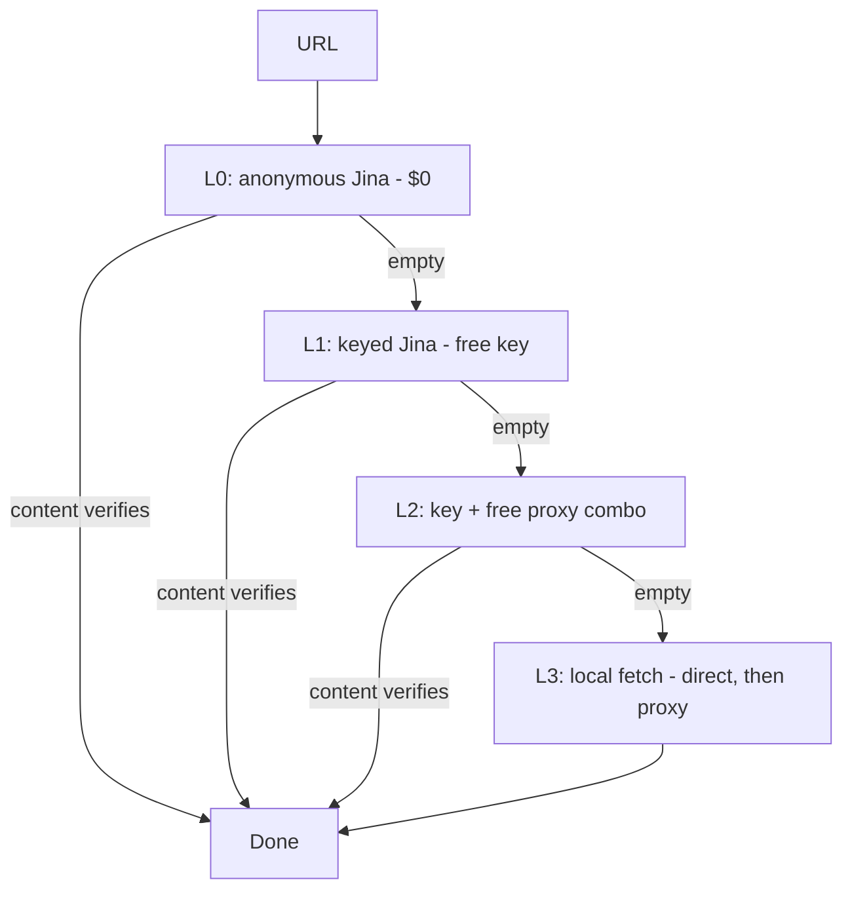

# ScrapingG4cor

Free scraper for any site. One command, cheapest working layer wins.
Works.

## How it works



If anonymous Jina works, stop. If not, try with a free Jina API key.
If that fails, try key + free proxy. If that fails, fetch locally.
Every layer is verified by content (price + product markers), never HTTP
status alone.

## Usage

```bash
python3 -m venv .venv && .venv/bin/pip install -r requirements.txt

# Fetch any page (anonymous Jina first — free, no key needed)
python3 scrape.py fetch "https://example.com/search?q=shoes"

# Your own targets (you decide the sites)
python3 scrape.py sites      # builtin + yours (yours tagged [yours])
python3 scrape.py my-sites   # yours only
python3 scrape.py add-site my-shop "https://example.com/search?q={q}" \
  --price "£,$" --ok "Add to Cart"
python3 scrape.py fetch "https://example.com/search?q=shoes" --site my-shop
python3 scrape.py remove-site my-shop

# If L0 is empty, grab a free Jina key (unlocks L1 + L2), then retry
python3 scrape.py key guide
python3 scrape.py key set
python3 scrape.py key status

# Batch hunts + free-proxy pool refresh
python3 scrape.py prep
python3 scrape.py hunt "shoes" "boots" --max 100 --want 3
```

`{q}` in a target URL is the keyword slot (optional — fixed catalog URLs
work too). `--ok` defaults to the URL hostname; `--price` defaults to `£`.
Your targets live in `targets.json` next to the scripts (chmod 600,
git-ignored — never pushed). `targets.example.json` shows the file shape.

If a product has no match on a site, it means that site does not carry it —
not a scraper failure.

## Files

| File | Does |
|---|---|
| `scrape.py` | The one door — every command above routes through here |
| `fetch_chain.py` | The chain L0→L1→L2→L3 + your-target commands |
| `sites.py` | Builtin defaults + YOUR `targets.json` (you win on clash) |
| `get_key.py` | Jina key helper (`guide` / `set` / `status`) |
| `jina_combo.py` | Keyed Jina fetch + proxy combo primitives |
| `hunt_workflow.py` | Batch workflow: `prep` pools → `check` → `fix` → `hunt` |
| `rotator.py` | Ranked-proxy rotator (fail → next proxy) |
| `uscraper.py` | Ladder L0/L1/L3/L5 + signal detector + proxy validator |

Keys live in env (`JINA_API_KEY`) or `~/.jina_key` (chmod 600).
Never hardcoded, never committed.

## Notes

- Cheap first, expensive last. Anonymous Jina ($0) before key, key before proxy.
- Content verdicts only: price + product markers must be present, or the layer counts as empty.
- Free proxies burn in minutes — refresh the pool on every hunt (`prep`), never trust yesterday's pool.
- Gate 202 is NOT success (challenge page, not content).

## License

MIT — see `LICENSE`.
