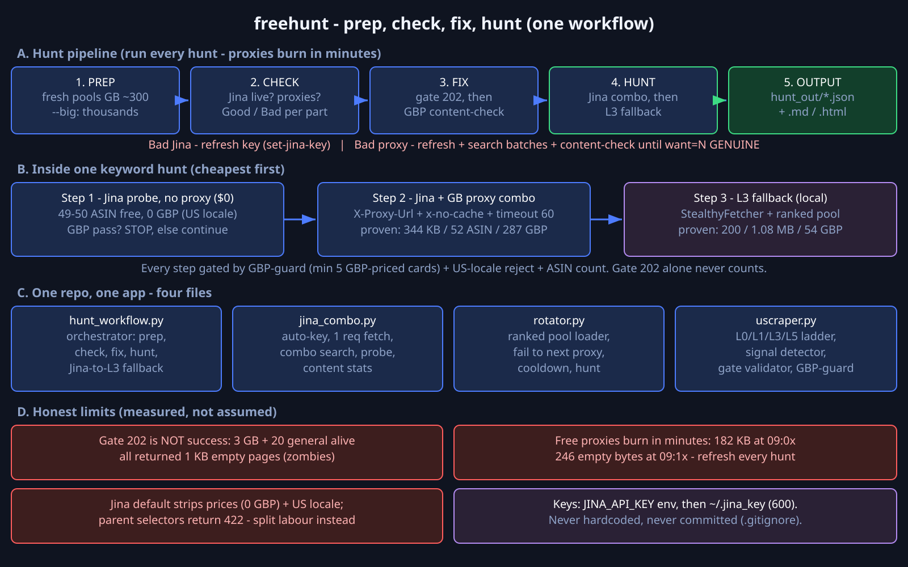

# freehunt

Free-proxy Amazon UK scraper. One workflow — `prep -> check -> fix -> hunt` — that combines
[Jina Reader](https://jina.ai/reader) (free cloud render) with fresh free proxies and a local
StealthyFetcher fallback. No paid API required for the core loop.



## Why this exists

Amazon UK is guarded by AWS WAF, which rejects datacenter IPs at the reputation check.
Two proven facts drive this project:

1. **Gate 202 does not mean success.** A proxy can return HTTP 202 with a 1 KB empty page.
   Only GBP-priced content counts (`pool_ranked.json` verdicts: GENUINE vs zombie).
2. **Free proxies burn in minutes.** A proxy that yields 182 KB at 09:0x returns 246 empty
   bytes at 09:1x. Refresh the pool on every hunt, validate content (not just gate), rotate.

## Quickstart

```bash
python3 -m venv .venv && .venv/bin/pip install -r requirements.txt
.venv/bin/python -m playwright install chromium   # needed for L3 fallback
export JINA_API_KEY=jina_...                      # or: python3 jina_combo.py set-key <KEY>

python3 hunt_workflow.py auto "creatine" --max 100 --want 3
```

Keys are read from `JINA_API_KEY` / `JINA_KEY` env first, then `~/.jina_key` (chmod 600).
Never hardcoded. `set-key` strips pasted spaces automatically.

## The workflow

```
PREP  ->  CHECK  ->  FIX  ->  HUNT  ->  OUTPUT (hunt_out/*.json + *.md/*.html)
```

| Command | What it does |
|---|---|
| `prep [--big]` | Fetch fresh pools (Proxifly GB ~300; `--big` adds general sources, thousands). Backs up old pools with timestamps. |
| `check [--sample 50]` | Verdict per component: Jina live? Proxies alive? Prints Good / Bad + fix hint. |
| `hunt "kw1" "kw2" [--max 50] [--want 3]` | Auto check+fix, then per keyword: Jina probe (free) -> Jina+proxy combo -> **L3 fallback** (local StealthyFetcher + ranked pool). |
| `auto ...` | `prep` + `hunt` in one go. |
| `set-jina-key <KEY>` | Store/refresh the Jina key (`~/.jina_key`, chmod 600). |
| `jina_combo.py fetch URL [--proxy ...]` | Single Jina request with summary stats (no full-body dump). |
| `rotator.py fetch URL [--max 5]` | L3 fetch through ranked proxies, auto-advance on failure. |
| `uscraper.py selftest / probe / validate / fetch / bd-*` | Ladder primitives + proxy gate validator + optional Bright Data L5. |

Flags: `--no-content-check` (gate-only verdicts, fast but weak),
`--no-l3` (Jina only), `--l3-max N` (L3 fallback pool size per keyword).

## Measured numbers (2026-10-07/08, live runs)

| Setup | Result |
|---|---|
| Jina + fresh GB proxy (B7) | 344 KB / 52 ASIN / **287 GBP prices** / 55 ratings / US-free |
| L3 local StealthyFetcher (ranked proxy) | HTTP 200 / 1.08 MB / 55 ASIN / **54 GBP** / SUCCESS |
| Jina no-proxy probe | 49-50 ASIN, **0 GBP** (US locale) — free ASIN discovery |
| GB pool gate-alive | ~1.7-3% (240 checked -> 4 gate-alive) |
| Content-check of 15 gate-alive | **7 GENUINE** (`pool_ranked.json`) |
| `uscraper.py selftest` | 6/6 offline PASS |

## Honest limits

- **Jina default output strips prices.** Readability drops `.a-price` as noise; locale is US.
  `X-Target-Selector: .a-price` recovers USD prices only. GBP needs `X-Proxy-Url` + GB proxy.
- **Jina vs Amazon is query-dependent.** 1-word queries passed (HTTP 200), 2-word queries got
  503 on the same day. WAF strictness fluctuates; the L3 fallback exists for this.
- **Parent selectors don't work on Jina** (`[data-component-type]`, `.s-result-item` -> 422):
  Jina matches selectors after readability cleanup, so ASIN<->price mapping via Jina alone
  is a dead end. Split labour instead: Jina harvests links, L3 fetches prices.
- **`X-Proxy: gb` (residential) needs a premium Jina plan** (402 on free key). `X-Proxy-Url`
  with your own proxy works on the free key (500 RPM).
- Free proxies die fast. General (non-GB) pools have higher gate-alive rates but weaker GBP
  yields. For final GBP prices prefer GB exits or Bright Data L5 (optional, paid).

## Files

| File | Role |
|---|---|
| `hunt_workflow.py` | prep/check/fix/hunt orchestrator + Jina->L3 fallback |
| `jina_combo.py` | Jina auto-key + single fetch + combo search |
| `rotator.py` | L3 ranked-pool rotator (fail -> next proxy) |
| `uscraper.py` | L0/L1/L3/L5 ladder + signal detector + gate validator + GBP-guard |
| `requirements.txt` | `scrapling[fetchers]`, `playwright` (system `curl` also required) |
| `docs/architecture.svg` | architecture diagram (source of truth; PNG is rendered) |

Pools (`pool_*.txt`), rankings (`pool_ranked.json`) and outputs (`hunt_out/`, `*.html`)
are git-ignored: regenerate with `prep` every hunt.

## License

MIT — see `LICENSE`.
