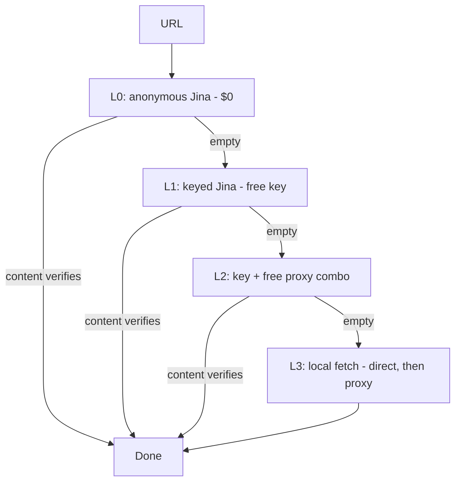

# ScrapingG4cor

Free scraper for all sites. One fetch chain, cheapest working layer wins.
Works.

## How it works



If anonymous Jina works, stop. If not, try with a Jina API key.
If that fails, try key + free proxy. If that fails, fetch locally.
Every layer is verified by content (price + product markers), never HTTP status alone.

## Sites

All sites in `sites.py` — one dict per site (URL template, method, success
markers). New site = new dict, no workflow rewrite.

| Site key | Site | Fetch method |
|---|---|---|
| `amazon-uk` | Amazon UK | Jina render + GB proxy + key; L3 StealthyFetcher fallback (AWS WAF) |
| `active-sports-nutrition` | Active Sports Nutrition | Search pages `?q=&size=100&skip=0..300`, tile split, price from `finalPrice.amountIncVat` |
| `dolphin-fitness` | Dolphin Fitness | List pages `/en/creatine/list/1..9`, cell split, lowest `£` per cell |
| `holland-and-barrett` | Holland & Barrett | Jina Reader (direct returns 202 challenge), markdown product links |
| `applied-nutrition` | Applied Nutrition | Shopify `/products.json` paginated, variant price + barcode |
| `10x-athletic` | 10X Athletic | Shopify `/products.json` paginated, variant price + barcode |
| `animal-pak` | Animal Pak | Shopify `/products.json` paginated, variant price + barcode |
| `cellucor-uk` | Cellucor UK | Homepage `/product/*` links, price from JSON-LD, barcode from `gtin13` |
| `iherb-uk` | iHerb UK | Search pages `?kw=&p=1..20`, split on `data-product-id`, Jina fallback |
| `reflex-nutrition` | Reflex Nutrition | Shopify `/products.json` paginated, variant price + barcode |

If a product has no match on a site, it means that product is sold on only
1 site (no competitor carries it) — not a scraper failure.

## Files

| File | Does |
|---|---|
| `fetch_chain.py` | The chain: `sites` lists targets, `fetch URL --site <key>` runs L0→L1→L2→L3 |
| `sites.py` | Site registry (URL, method, markers, notes) |
| `get_key.py` | Jina key helper: `guide` (where to get a free key), `set` (validate + store), `status` |
| `jina_combo.py` | Keyed Jina fetch + proxy combo primitives |
| `hunt_workflow.py` | Batch workflow: `prep` pools → `check` → `fix` → `hunt` keywords (Amazon-tuned) |
| `rotator.py` | Ranked-proxy rotator (fail → next proxy) |
| `uscraper.py` | Ladder L0/L1/L3/L5 + signal detector + proxy validator |

## Usage

```bash
python3 -m venv .venv && .venv/bin/pip install -r requirements.txt

# 1. List all sites
python3 fetch_chain.py sites

# 2. Fetch one page (anonymous Jina first — free, no key)
python3 fetch_chain.py fetch "https://www.hollandandbarrett.com/shop/sports-nutrition/creatine/" --site holland-and-barrett

# 3. If L0 is empty, get a free Jina key, then retry (unlocks L1 + L2)
python3 get_key.py guide
python3 get_key.py set
python3 get_key.py status

# 4. Batch hunts (Amazon-tuned) + free-proxy pool refresh
python3 hunt_workflow.py auto "creatine" --max 100 --want 3
python3 rotator.py fetch "https://www.amazon.co.uk/s?k=creatine" --max 5
```

Keys live in env (`JINA_API_KEY`) or `~/.jina_key` (chmod 600).
Never hardcoded, never committed.

## Notes

- Cheap first, expensive last. Anonymous Jina ($0) before key, key before proxy.
- Content verdicts only: price + product markers must be present, or the layer counts as empty.
- Free proxies burn in minutes — refresh the pool on every hunt (`prep`), never trust yesterday's pool.
- Gate 202 is NOT success (challenge page, not content).

## License

MIT — see `LICENSE`.
